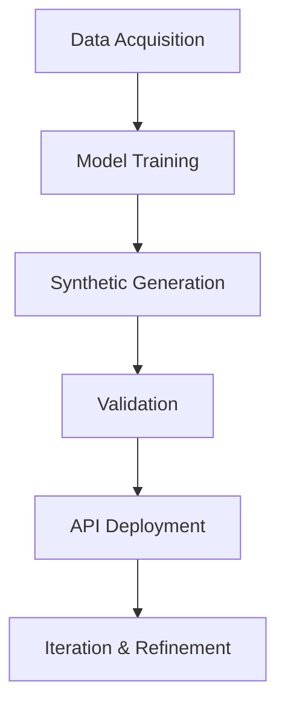

```
# 🧬 Synthetic Data Generator for ML Development – Web Application

[](https://www.python.org/)
[](https://mern.io/)
[](LICENSE)

> ⚡ Generate realistic, high-quality, privacy-preserving synthetic datasets for ML workflows using a modern web interface and API-driven architecture.

---

## 📦 Overview

The **Synthetic Data Generator** is a full-stack platform and web application designed to generate high-quality synthetic datasets that preserve the statistical structure of real-world data without exposing sensitive information.

It supports:
- 🧾 Tabular data
- 📈 Time-series data
- 🧠 Prompt-based data generation

Built for developers, researchers, and data scientists, this tool enables safe experimentation, model validation, data sharing, and rapid API prototyping — all while maintaining privacy and compliance.

---

## ✨ Features

### 🔄 Data Generation Modes
- **Prompt-Based**: Describe data requirements using natural language
- **File-Based**: Upload CSV or Excel files to generate statistically similar synthetic data
- **Schema-Based**: Define structured JSON schemas with constraints

### 🧬 Core Capabilities
- Multi-format generation: CSV, JSON, Excel
- Domain customization (healthcare, finance, custom schemas)
- Statistical similarity preservation
- Edge-case and rare-event simulation
- Validation tools for consistency and usability
- Differential Privacy integration
- Mock API-as-a-Service for synthetic API testing

### 🎨 Modern UI
- Vibrant gradient design
- Smooth animations
- Glassmorphism effects
- Fully responsive layout
- Drag-and-drop file upload

---

## 🎯 Use Cases

| Domain | Application Example |
|---|---|
| 🏥 **Healthcare** | Privacy-safe synthetic patient and clinical datasets |
| 💰 **Finance** | Fraud detection and rare-event augmentation |
| 🤖 **ML Development** | Handling imbalanced classes and edge cases |
| 🔄 **Data Sharing** | Sharing realistic datasets without exposing real data |
| 🚀 **Prototyping** | Testing applications with synthetic APIs |

---

## 🛠 Tech Stack

| Layer | Technologies Used |
|---|---|
| **Backend** | Python, Flask, FastAPI |
| **Frontend** | MERN Stack (MongoDB, Express.js, React.js, Node.js) + Vanilla HTML/CSS/JS |
| **ML Models** | CTGAN, TVAE (Tabular), RNN, TimeGAN (Time-Series), Nemotron, BERT (Prompt-based) |
| **Data Gen** | Mimesis Library |
| **Validation** | Statistical metrics, correlation checks, coverage analysis |
| **Styling** | Custom modern CSS |

---

## 🧰 Installation & Setup

### 🔧 Clone the Repository
```bash
git clone https://github.com/BharathJP-72/Synthetic-Data-Generator.git
cd Synthetic-Data-Generator

```

### 🐍 Backend / Web App Setup

```bash
# Install main project dependencies
pip install -r requirements.txt

# Install web application dependencies
cd webapp
pip install -r requirements-webapp.txt

```

### 🌐 Frontend Setup (MERN)

```bash
cd frontend
npm install
npm start

```

### 🚀 Run the Application / API

```bash
python app.py

```

### 🌐 Access the Web Interface

Open your browser and navigate to:
`http://localhost:5000`

---

## 📊 Usage Guide

### 🧠 Prompt-Based Generation

1. Select **Prompt-Based** tab
2. Describe data in natural language
3. Set number of rows
4. Choose output format
5. Click **Generate Data**

### 📁 File-Based Generation

1. Select **File-Based** tab
2. Upload CSV or Excel file (drag & drop supported)
3. Set rows to generate
4. Choose output format
5. Optionally preserve statistical properties
6. Click **Generate Data**

### 🧩 Schema-Based Generation

1. Select **Schema-Based** tab
2. Define a JSON schema with constraints
3. Set number of rows
4. Choose output format
5. Click **Generate Data**

**Example Schema:**

```json
{
  "name": {"type": "string", "mimesis": "person.full_name"},
  "email": {"type": "string", "mimesis": "person.email"},
  "age": {
    "type": "integer",
    "mimesis": "person.age",
    "constraints": {"min": 18, "max": 65}
  },
  "city": {"type": "string", "mimesis": "address.city"}
}

```

---

## 🔌 API Endpoints

| Method | Endpoint | Description |
| --- | --- | --- |
| `GET` | `/api/health` | Health Check |
| `POST` | `/api/generate/prompt` | Generate from Prompt |
| `POST` | `/api/generate/file` | Generate from File |
| `POST` | `/api/generate/schema` | Generate from Schema |

---

## 🔄 Workflow



---

## ⚙️ Configuration

* **Port:** Default `5000` (modifiable in `app.py`)
* **Max File Size:** 16MB (`MAX_CONTENT_LENGTH`)
* **Upload Directory:** `webapp/uploads/` (auto-created)

---

## 🛠 Troubleshooting

**Module not found errors**

> Ensure both `requirements.txt` files are installed.

**Port already in use**

> Change port in `app.py` or stop existing service.

**File upload fails**

> Ensure file size ≤ 16MB and format is CSV or Excel.

---

## 🧪 Development Mode

```bash
python app.py

```

*The Flask application runs with `debug=True` by default.*

---

## 📄 License

This project is licensed under the MIT License.

```

