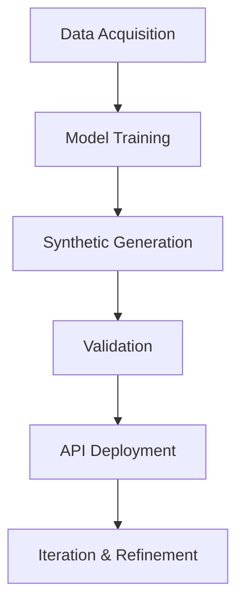

---

# 🧬 Synthetic Data Generator for ML Development

[](https://www.python.org/)  
[](https://mern.io/)  
[](LICENSE)

> ⚡ Generate realistic, privacy-preserving synthetic datasets for ML workflows — with full-stack flexibility and API deployment.

---

## 📦 Overview

The **Synthetic Data Generator** is a full-stack platform that creates high-quality synthetic datasets while preserving the statistical essence of real-world data. It supports:

- 🧾 Tabular data  
- 📈 Time-series data  
- 🧠 Prompt-based data  

Built for developers, researchers, and data scientists, this tool enables safe experimentation, model validation, and rapid API prototyping — all without compromising privacy.

---

## ✨ Features

- 🔄 **Multi-format Generation**: Tabular, time-series, and prompt-based datasets  
- 🧬 **Domain Customization**: Healthcare, finance, or user-defined schemas  
- 📊 **Quality Metrics**: Coverage, correlation, and statistical similarity  
- 🛡️ **Privacy-Preserving**: Differential Privacy integration  
- 🔌 **Mock API-as-a-Service**: Deploy synthetic APIs for testing and development  
- 🧪 **Edge Case Simulation**: Generate rare or extreme scenarios  
- ✅ **Validation Tools**: Ensure consistency and usability of synthetic data

---

## 🎯 Use Cases

| Domain      | Application Example                                      |
|-------------|-----------------------------------------------------------|
| 🏥 Healthcare | Synthetic patient records for privacy-safe research       |
| 💰 Finance   | Fraud detection and rare event augmentation               |
| 🤖 ML Dev    | Handle imbalanced classes and underrepresented scenarios |
| 🔄 Data Sharing | Share realistic datasets without exposing real data     |
| 🚀 Prototyping | Test apps with synthetic APIs before real data access    |

---

## 🛠 Tech Stack

| Layer      | Technologies Used                                                                 |
|------------|------------------------------------------------------------------------------------|
| Backend    | Python (ML models, FastAPI)                                                       |
| Frontend   | MERN Stack (MongoDB, Express.js, React.js, Node.js)                               |
| ML Models  | CTGAN, TVAE (Tabular), RNN, TimeGAN (Time-Series), Nemotron, BERT (Prompt-based)  |
| Privacy    | Differential Privacy                                                              |
| Validation | Statistical metrics, correlation checks, coverage analysis                        |

---

## 🧰 Installation & Setup

### 🔧 Clone the Repository
```bash
git clone https://github.com/YourUsername/Synthetic-Data-Generator.git
cd Synthetic-Data-Generator
```

### 🐍 Backend Setup
```bash
cd backend
python -m venv venv
source venv/bin/activate      # Linux/Mac
venv\Scripts\activate         # Windows
pip install -r requirements.txt
```

### 🌐 Frontend Setup
```bash
cd frontend
npm install
npm start
```

### 🚀 Run the API
```bash
cd backend
python app.py
```

---

## 🔄 Workflow



---

## 📄 License

This project is licensed under the [MIT License](LICENSE).

---